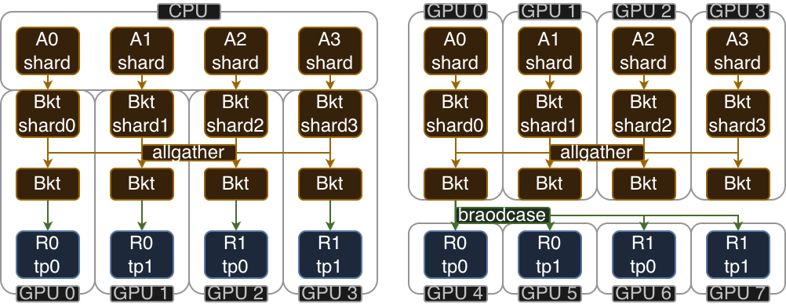

# Placement: actor / critic / rollout

This document describes how slim places the **actor**, **critic**, and **rollout** processes onto GPUs. Note the **actor** oversee both "policy" and "refernce" model and manage with inprocess offload since they share the same compute graph. 

## Notation

Each role declares an overall GPU total. Actor and critic each form one distributed NeMo world, while rollout also declares a per-replica size.

| role | overall total | topology |
|---|---|---|
| actor   | `--actor-num-gpus` (`A`) | FSDP2 with `--context-parallel-size` and `--expert-model-parallel-size` |
| critic  | `--critic-num-gpus` (`C`) | FSDP2 with `--context-parallel-size` and `--expert-model-parallel-size` |
| rollout | `--rollout-num-gpus` (`R`) | `--rollout-num-gpus-per-replica`; replica count is `R / rollout_num_gpus_per_replica` |

| role | within its distributed world | data parallelism |
|---|---|---|
| actor / critic | FSDP2 with context parallelism and optional expert parallelism | pure FSDP across each complete training world |
| rollout | one sglang engine with TP <br> and optional PP / EP / PD-disaggregation | router-balanced (DP) |


## Colocate

**actor**, **critic**, and **rollout** processes can time share same GPUs with colocate.
Slim supports two independent colocate strategy.

| args | meaning |
|---|---|
| `--rollout-colocate` | rollout engines share the **training** GPUs (time-shared via offload) |
| `--critic-colocate` | critic shares the **actor** GPUs instead of taking its own |

## Placement

A single PACK'd Ray placement group (PG) is created over all nodes sorted by `(node_ip, gpu_id)`, then sliced by following per-role offsets (`placement_group.py:create_placement_groups`).

| # | rollout colocate | critic colocate | PG total | critic_offset | rollout_offset | async-capable | layout |
|---|:--:|:--:|:--:|:--:|:--:|:--:|---|
| 1 | ✗ | ✗ | A+C+R | A | A+C | ✅ | <pre>0 1    \| 2 3    \| 4 5 6 7<br>└actor─┘ └critic┘ └rollout┘</pre> |
| 2 | ✓ | ✗ | A+C   | A | 0   | ❌ | <pre>0 1 2 3 \| 4 5 6 7<br>└actor──┘ └critic─┘<br>└rollout──────────┘</pre> |
| 3 | ✗ | ✓ | A+R   | 0 | A   | ✅ | <pre>0 1 2 3 \| 4 5 6 7<br>└actor──┘ └rollout┘<br>└critic─┘</pre> |
| 4 | ✓ | ✓ | A     | 0 | 0   | ❌ | <pre>0 1 2 3<br>└actor──┘<br>└critic─┘<br>└rollout┘</pre> |

### Ray bundle resource quota

Ray abstract each GPU as one PG **bundle** (`{"GPU": 1, "CPU": 1}`). 
When roles colocate, several processes land on the same bundle, so each is given a fractional `num_gpus` quota and Ray only co-schedules them if the quotas sum to `<= 1.0`.
The quotas are **scheduling weights, not memory limits**: GPU memory isolation is disabled (`RAY_EXPERIMENTAL_NOSET_CUDA_VISIBLE_DEVICES=1`), so every co-scheduled process sees the whole card. 

Slim manage time-slicing with offload (`sleep`/`wake_up` premitive).
Slim set fixed quotas: actor `0.4`, critic `0.4`, rollout `0.2`, so all colocate placement are valid.

## Step timeline

### no critic-colocate (# 1 & 2)

When actor and critic are on **disjoint** GPUs they run **concurrently**. Each have their own NCCL world.

```
                 GPU memory resident
phase               A      C      
─────────────────────────────────
1. compute          ■      ■      ref/actor-old log-probs (A) ∥ compute_values (C)
────────────────────┼──────┼──── ◀ critic values ready
2. targets          ░      ░      AdvantageEstimator publishes Episode shards with training targets
3. train            ■      ■      actor.train ∥ critic.train
────────────────────┼──────┼──── ◀ barrier: ray.get(actor.train); ray.get(critic_train_handle)
4. actor.update_wts ■      ░      actor pushes weights → rollout engines

legend:
■ active resident ░ idle resident · offloaded (CPU)
```

### under colocate-critic (# 3 & 4)

When the critic shares the actor's GPUs, the actor and critic **cannot run
concurrently**. Two NCCL worlds issuing collectives on one device will hang or
OOM.

```
                  GPU memory resident
phase                A      C 
─────────────────────────────────
1. critic.wake_up()  ·      ■
2. compute_values    ·      ■        critic forward produces value payloads
3. targets           ·      ░        AdvantageEstimator publishes Episode shards with training targets
4. critic.train      ·      ■        critic consumes old values and value targets
5. critic.sleep() ───┼──────┼──── ◀ HANDOFF: critic is offloaded before actor wakeup
6. actor.wake_up()   ■      ·
7. compute_log_probs ■      ·        optional ref and actor-old log probabilities
8. actor.train       ■      ·        actor consumes advantages
9. actor.update_wts  ■      ·        push weights → rollout engines
10. actor.sleep()    ·      ·

legend:
■ active resident ░ idle resident · offloaded (CPU)
```

Actor and critic construct separate physical packs from the Episode shards containing training targets. This keeps packing and placement role-local. Mismatch correction is also actor-local and runs after actor-old and rollout log probabilities are available.

---

## Weight Update

On-policy RL syncs model weights from the FSDP actor to the SGLang rollout engines at every training step.
Slim treats each engine as an opaque unit of `rollout_num_gpus_per_replica` GPUs.
How the engine internally splits those GPUs (TP/PP/DP/EP) is configured via sglang args and is transparent to the weight update path; the sglang engine discards any param slice it does not need.
The NeMo state-dict adapter converts each tensor to its Hugging Face name and layout before transport.



### Colocate path

After training, the actor model is offloaded to CPU.
During weight update, params are streamed from CPU to GPU one bucket at a time: each param is moved to GPU, all-gathered across the FSDP mesh, pushed to the engine, then freed.
Only one bucket of params lives on GPU at a time, so the full model never needs to fit in GPU memory alongside the engine.

For each bucket, ranks serialize their tensors as CUDA IPC handles.
Gloo collects all handles to the source rank (first rank in the IPC group, e.g. A0, A2).
The source rank issues a single Ray RPC to the engine, passing all handles.
The engine dispatches each handle to its corresponding TP worker, which opens it from its colocated actor rank (zero-copy, same GPU).
The actual tensor data never crosses GPUs; only the small IPC handle metadata is gathered.

### Separate path

The same FSDP all-gather by buckets followed by 
Only A0 broadcasts to all engine TP workers directly.
Each TP worker receives the full param and keeps only its slice.

### sync with low precision inference

A quantizer quantizes each bucket from BF16 to block-FP8 format between all-gather and send.
Rollout engines receive weights in the same quantized format they were initialized with.

### sync with failed engines

Slim also keeps a heart beat health check on all sglang engines and kills any non-responsive ones. 
The killed engine are restarted before weight sync and receive fresh memory and join next batch of training.
