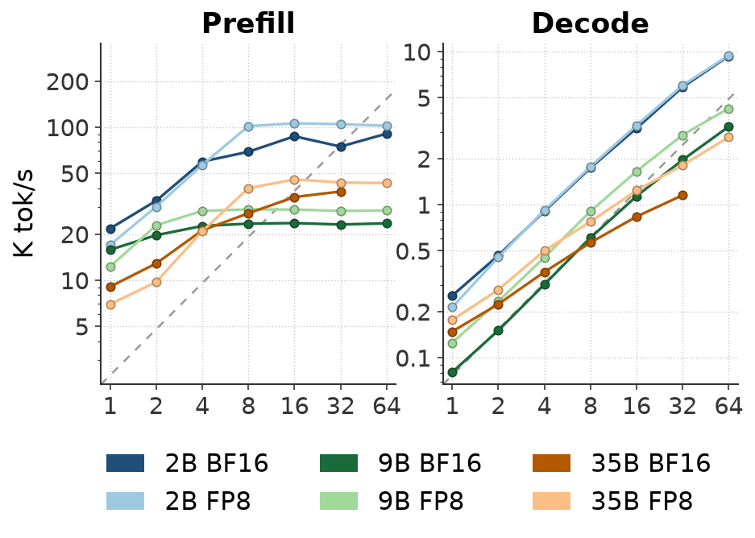
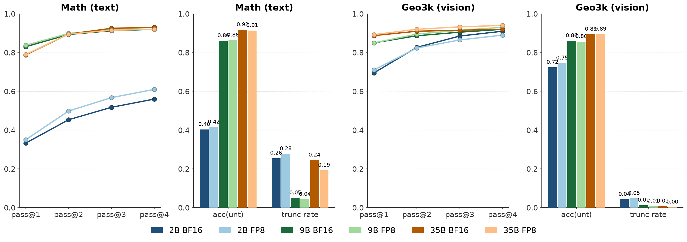
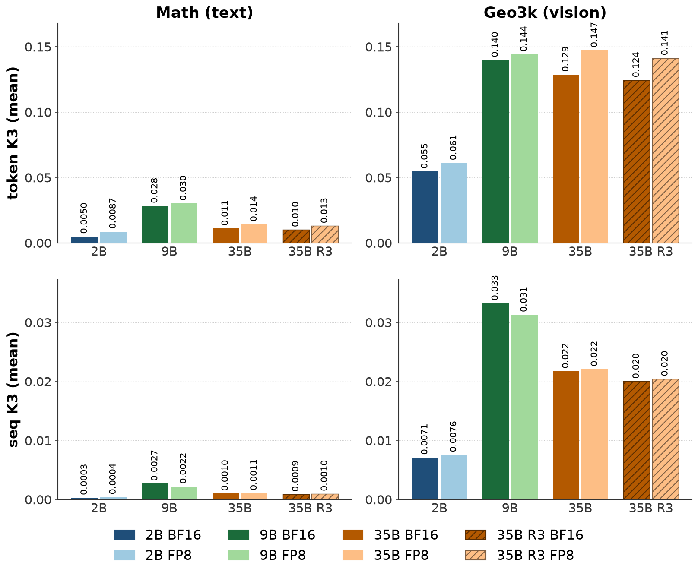

# Low Precision Inference on Throughput, Accuracy, and Rollout-Train Discrepancy

Rollout stage can take up over half of RL training wall time.
Low precision models (e.g. FP8, NVFP4) can leverage hardware FLOPS speedup to reduce inference time while offering near loss-less performance.
However, low precision inference introduces rollout-train discrepancy and numerical instability.
This report documents the interplay of low precision inference on throughput, accuracy, and rollout-train discrepancy on dense and MoE models.

## Preliminary

### Models

We benchmark **Qwen3.5-2B**, **Qwen3.5-9B**, and **Qwen3.5-35B-A3B** (MoE). The rest of the Qwen3.5 family is laid out for context — all share `head_dim` 256, vocab 248320, and a 3:1 linear/full-attention hybrid ratio.

| Model | hidden | head_dim | Q heads | KV heads | Layers (lin/full) | Experts (top-k) |
|-------|--------|----------|---------|----------|-------------------|-----------------|
| **Qwen3.5-2B**   | 2048 | 256 | 8  | 2 | 24 (18/6)  | — (dense) |
| Qwen3.5-4B       | 2560 | 256 | 16 | 4 | 32 (24/8)  | — (dense) |
| **Qwen3.5-9B**   | 4096 | 256 | 16 | 4 | 32 (24/8)  | — (dense) |
| Qwen3.5-27B      | 5120 | 256 | 24 | 4 | 64 (48/16) | — (dense) |
| **Qwen3.5-35B-A3B** | 2048 | 256 | 16 | 2 | 40 (30/10) | 256 (top-8)  |
| Qwen3.5-122B-A10B   | 3072 | 256 | 32 | 2 | 48 (36/12) | 256 (top-8)  |
| Qwen3.5-397B-A17B   | 4096 | 256 | 32 | 2 | 60 (45/15) | 512 (top-10) |

The two dense baselines bracket the MoE on different axes. The **2B** is the **iso-width** baseline that differs in depth (24 vs 40 layers) and Q-heads (8 vs 16). The **9B** is the **iso-capacity** baseline: its ~9B parameters sit near the geometric mean of the MoE's ~34B total and ~2.9B active (√(34·2.9) ≈ 9.9B), a common rule-of-thumb for a dense model of equivalent effective capacity.

### Quantized precision & GEMM backends

This report targets low precision rollout and full precision training recipe, i.e. only post-training quantization (PTQ) during weight sync, no quantization aware training (QAT).
Experiment conducted on one RTX-PRO-6000 (Blackwell, SM120).
Each model is evaluated in **BF16** and **FP8** precisions. 
The FP8 checkpoint is post-training quantized with following recipe (same as Qwen3.5 official FP8 checkpoints):
- 128×128 block e4m3 FP8,
- fp32 block scales,
- dynamic activations (w8a8),
- modules kept in **BF16**: 
  - `lm_head`, `embed_tokens`, 
  - the linear-attention projections (`linear_attn.conv1d`/`in_proj_a`/`in_proj_b`), 
  - the vision tower (`visual`),
  - the MoE routing gates (`mlp.gate`, `mlp.shared_expert_gate`),
  - the MTP head (`mtp.fc`) (not used in this report)

Experiment used following backends with triton auto-tuned block-FP8 kernels:

| | Attention Backend | GEMM Backend |
|---|-------------------|--------------|
| BF16 Train (fwd-only) | SDPA | cuBLAS |
| BF16 SGLang inference | FlashInfer | cuBLAS |
| FP8 SGLang inference | FlashInfer | Triton block-FP8 |

## Throughput

We measured prefill and decode throughput via `sglang.bench_one_batch` (input=512, output=1024, context=1536) across concurrency $1\sim64$.

> FP8 could offer over **50%** decode speedup on high concurrency workloads. 
> We observe the roof-line model: high concurrency prefill hit compute bound, where as decode always hit memory bandwidth bound on GDDR7 (not HBM). 
> With future DeepGEMM (ue8m0 scale) or cuBLAS backends adding SM120 FP8 support, we expect the speedup to improve on low concurrency end.

## Accuracy

Each model generated **4 samples** per prompt on **100 prompts** from **DAPO-Math-17k** (text) and **Geometry3K** (vision) with 16K max context respectively.
We report **pass@k**, **acc(unt)** (the accuracy of the sequences that ended naturally), and **trunc rate**.

> The accuracy difference between FP8 and BF16 is within the margin of sampling noise. 
> FP8 offers near loss-less performance.

## Rollout-Train Policy Discrepancy

In RL, generated tokens are sampled from the rollout engine (sglang) under $\pi_{\text{rollout}}$, but the policy-gradient is taken on the training actor (HF/FSDP) $\pi_{\text{train}}$. The quantized inference introduce addition discrepancy to already-existed numerical gap (floating point arithmetic is not associative) and expert-routing divergence in MoEs [ref: Rollout Routing Replay R3].

Denote the model-generated token (i.e. the realized token at each step) as $t_i$. The per-token log-ratio and sequence-mean log-ratio are:
$$
\begin{aligned}
\log r_i &= \log\pi_{\text{train}}(t_i) - \log\pi_{\text{rollout}}(t_i) \\
\overline{\log r} &= \frac{1}{L}\sum_{i=1}^{L}\log r_i
\end{aligned}
$$
We measure the **rollout-train discrepancy** as $\mathrm{KL}(\pi_{\text{rollout}}\|\pi_{\text{train}})$ and report the **k3** estimator (Schulman) at token and sequence level:
$$
\begin{aligned}
\text{K3}_{\text{tok}} &= \mathbb{E}_{\textcolor{red}{t_i} \sim \pi_{\text{rollout}}}\left[e^{\log r_i} - \log r_i - 1 \right] \\
\text{K3}_{\text{seq}} &=\mathbb{E}_{\textcolor{red}{t_:} \sim \pi_{\text{rollout}}} \left[e^{\overline{\log r}} - \overline{\log r} - 1\right]
\end{aligned}
$$

> FP8 inference introduces additional rollout-train discrepancy over BF16 inference, consistently but modestly, across all three models.
> Vision tasks are more sensitive than pure text due to their continuous (image-embedding) representation.
> R3 helps mitigate the MoE's expert-routing discrepancy.

## End-to-End RL Wall Time

Despite the near loss-less performance and decode speedup, the rollout-train discrepancy may still slows down the end to end RL wall time. The low precision inference is generating tokens faster, however, the importance sampling in policy gradient may end up drop / clip more tokens. This section compares end to end RL training performance gain under same workload.

ToCome